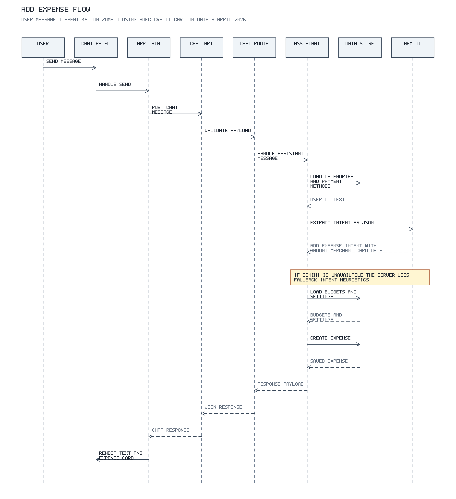
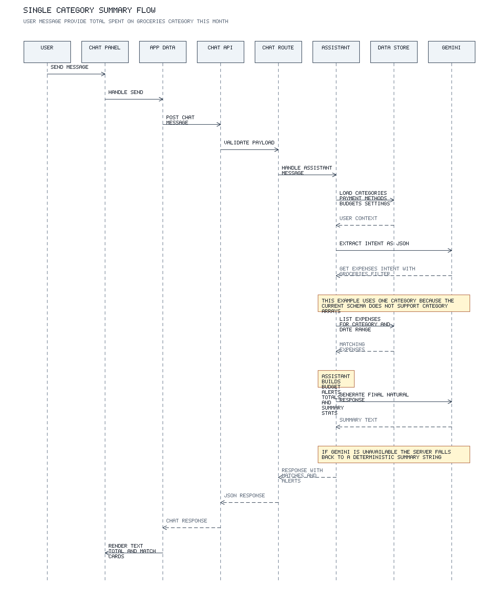

# AI Chat Flow

This document explains the current end-to-end AI chat flow in Wallet Wise.

Primary backend orchestration lives in `server/src/services/ai/assistant.ts`. The frontend entrypoint is `client/src/components/chat/ChatPanel.tsx`, and the request dispatch path runs through `client/src/store/AppDataContext.tsx` and `client/src/services/chat.ts`.

## Key Files

- `client/src/components/chat/ChatPanel.tsx`
- `client/src/store/AppDataContext.tsx`
- `client/src/services/chat.ts`
- `server/src/routes/chat.ts`
- `server/src/services/ai/assistant.ts`
- `server/src/lib/gemini.ts`
- `server/src/lib/data-store.ts`
- `server/src/lib/billing-cycles.ts`
- `server/src/schemas/domain.ts`

## Architecture Summary

The chat assistant uses a bounded two-pass AI pipeline:

1. The client sends a single free-form `message` string to `POST /api/chat`.
2. The server loads user context from the data store.
3. Gemini is used to extract a structured intent when an API key is configured.
4. The server normalizes that intent against real categories and payment methods.
5. The server executes the request with normal application logic.
6. For retrieval requests, Gemini is used a second time to phrase the final answer from ledger data that the server already fetched.
7. The client renders the assistant text plus any structured result cards.

The AI model never writes directly to the database and never decides which records are returned on its own. The LLM is only used for intent parsing and response wording.

## End-to-End Request Lifecycle

### 1. User input on the client

- `ChatPanel` collects the text input and calls `submitChatMessage(message)`.
- `submitChatMessage()` immediately appends the user message to local chat state.
- The client then sends `POST /chat` with `{ "message": "..." }`.

### 2. API entry and request validation

- The Express server mounts the chat router at `/api/chat`.
- The route validates the body with `chatRequestSchema`, which currently requires a non-empty `message` string only.
- The route resolves `userId` from auth middleware or the default dev user and calls `handleAssistantMessage(store, userId, message)`.

### 3. Context hydration before AI work

`handleAssistantMessage()` first loads the business context needed to interpret the query:

- categories
- payment methods
- current month budgets
- user settings

This context is loaded from the `DataStore` abstraction, which can be backed by memory or Firestore.

### 4. Intent extraction stage

`extractIntent()` is the first AI stage.

When Gemini is available:

- the server sends the user message
- the current date
- available categories
- available payment methods
- a strict JSON schema for the expected output

Gemini returns a structured `ChatIntent` with fields such as:

- `intent`
- `filters.category`
- `filters.source`
- `filters.paymentMethodName`
- `filters.billingCycle`
- `filters.dateRange`
- `amount`
- `merchant`
- `date`

When Gemini is not available, or parsing fails, the server falls back to `fallbackIntent()`, which uses keyword and regex heuristics.

### 5. Intent normalization

The raw extracted values are normalized against real app data:

- category names are matched against existing categories
- payment method names are matched against stored payment methods
- billing cycle month references are validated into `YYYY-MM`

This step prevents the execution layer from acting on arbitrary model text.

### 6. Deterministic execution

The server then switches on `intent.intent`.

#### `unknown`

- returns a canned help message
- no expense lookup or write happens

#### `add_expense`

- resolves the payment method
- builds a proper `ExpenseInput`
- writes the expense through `store.createExpense()`
- returns the saved expense plus a short confirmation message

#### `get_expenses` or `budget_status`

- converts the intent into `ExpenseFilters`
- optionally computes a billing-cycle date window for a credit card
- fetches matching expenses from the store
- computes budget alerts for categories at 80% or above

### 7. Final response generation stage

For retrieval flows, `generateResponse()` is the second AI stage.

When Gemini is available, the server sends:

- the original user query
- currency
- match count
- total amount
- top category
- up to 8 matching expenses
- computed budget alerts

Gemini then turns those structured results into a concise natural-language reply.

If Gemini is unavailable or errors, the server falls back to a deterministic summary generated by `formatExpenseSummary()`.

### 8. Response payload back to the client

The final response payload can include:

- `response`
- `intent`
- `expense`
- `matches`
- `budgetAlerts`

The client renders:

- the assistant text bubble
- an "Expense Saved" card for add-expense flows
- summary cards for matches, total, and top category
- budget alert cards when applicable

If the server created a new expense, the client also inserts that expense into local expense state immediately.

## Fallback and Current Limits

### Gemini disabled or unavailable

Without `GEMINI_API_KEY` or `GOOGLE_API_KEY`, the assistant still works in a narrower heuristic mode:

- intent extraction falls back to regex and keyword inference
- final prose generation falls back to a deterministic summary string

### Explicit free-form dates

Example 1 below uses an explicit date, `8-april-2026`.

- Gemini can often extract and return that date correctly.
- The heuristic fallback path does not currently parse that form reliably.
- In fallback mode, the server may default the date to the current server date instead.

### Multi-category requests

The current intent schema supports only a single `filters.category` value, not an array. Because of that, the original request "Provide total spent on Groceries, Food & Travel category" is not a clean fit for the current implementation.

This document therefore uses a simpler supported example for the second diagram:

`Provide total spent on Groceries category this month.`

## Sequence Diagrams

### Example 1

User message:

`I spent 450 on Zomato using HDFC Credit Card on date 8-april-2026.`



### Example 2

User message:

`Provide total spent on Groceries category this month.`



## Response Contract

Current response shape:

```ts
interface ChatResponsePayload {
  response: string;
  intent: ChatIntent;
  expense?: Expense;
  matches?: Expense[];
  budgetAlerts?: Array<{
    category: string;
    spent: number;
    limit: number;
    usage: number;
  }>;
}
```

## Diagram Assets

Generated files:

- `docs/diagrams/ai-chat-add-expense.png`
- `docs/diagrams/ai-chat-groceries-total.png`

Regenerate them with:

```bash
node scripts/generate-ai-chat-diagrams.js
```
